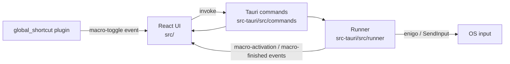
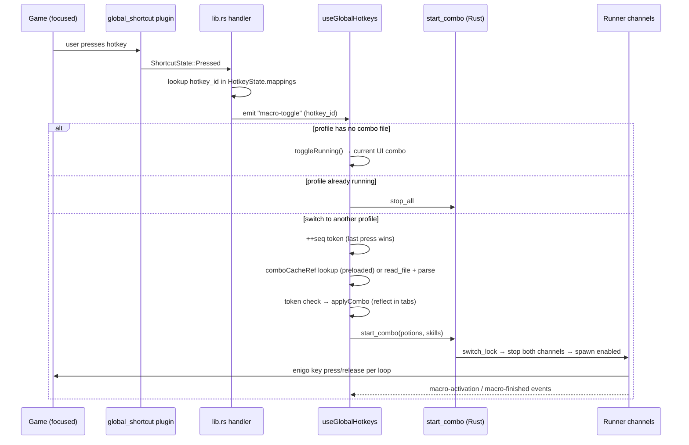
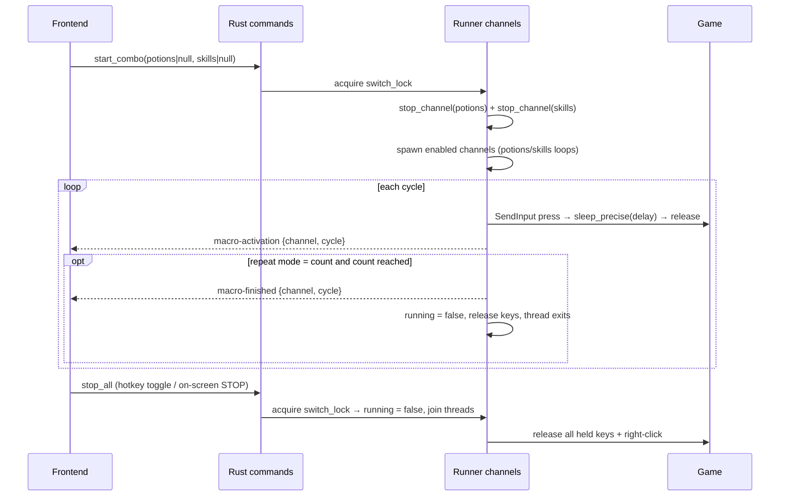

# Architecture — Hamin Macro Recorder

Tauri 2 app: React 19 + TypeScript frontend (`src/`), Rust backend (`src-tauri/`).
The frontend holds all editable state (settings, hotkeys, combo files) and talks to
the backend through Tauri commands; the backend owns the two macro loops and injects
keys with [enigo](https://github.com/enigo-rs/enigo) (Win32 `SendInput` on Windows).



## Component map

| Concern | Frontend | Backend |
|---|---|---|
| App shell, tabs, header | `src/app/` | — |
| Editable settings (potions/skills/hotkeys) | `src/{potions,skills,hotkeys}/use-*-settings.ts` | — |
| Combo files (open/save/new/auto-load) | `src/combo-file/` | `src-tauri/src/commands/files.rs` |
| Global hotkey wiring | `src/hotkeys/use-global-hotkeys.ts` | `src-tauri/src/commands/hotkeys.rs` |
| Start/stop + progress UI | `src/runner/use-macro-runner.ts` | `src-tauri/src/runner/` |
| Recording | `src/recorder/use-recorder.ts` | `src-tauri/src/commands/recorder.rs` |
| Compact overlay | `src/runner/use-compact-mode.ts` | — (window API) |

All Tauri commands are registered in `src-tauri/src/lib.rs`.

## Flow diagrams

### Hotkey press pipeline



### Start/stop pipeline



Key property: `start_combo`/`stop_all` run under `switch_lock`
(`src-tauri/src/runner/mod.rs`) and **stop both channels before starting**, so a
rapid stop/start can never interleave (e.g. potions of combo A running alongside
skills of combo B).

## Tauri commands

Args/returns are JSON-serialized camelCase (serde `rename_all = "camelCase"`).

| Command | Args | Returns | Purpose |
|---|---|---|---|
| `start_combo` | `potions: PotionConfig \| null`, `skills: SkillConfig \| null` | `()` | Atomically stop both channels, start the provided ones (`null` = leave stopped) |
| `stop_all` | — | `()` | Stop both channels under `switch_lock` |
| `save_file` | `path`, `content` | `()` | Write combo JSON (`fs::write`) |
| `read_file` | `path` | `string` | Read combo JSON (`fs::read_to_string`) |
| `list_combo_files` | `path` (dir) | `{name, path}[]` | List `.json` files in a directory, case-insensitive sorted (used by the Hotkeys tab file picker) |
| `set_hotkeys` | `hotkeys: {shortcut, hotkeyId}[]` | `()` | Diff-register global shortcuts; unregisters removed ones |
| `start_recording` | — | `()` | Start the key-polling thread |
| `stop_recording` | — | `{timestampMs, key, action}[]` | Stop polling, return recorded events |

`PotionConfig`/`SkillConfig` are the backend shapes (`src-tauri/src/runner/potions.rs`,
`skills.rs`); the frontend builds them with `toRunnerInputs` (`src/runner/runner-inputs.ts`).

## Event bus

| Event | Direction | Payload | Frequency |
|---|---|---|---|
| `macro-toggle` | Rust → frontend | hotkey id string | once per hotkey press |
| `macro-activation` | Rust → frontend | `{channel: "potions"\|"skills", cycle, keys?}` | potions: every **10** cycles (throttled); skills: every cycle |
| `macro-finished` | Rust → frontend | `{channel, cycle}` | once, when Repeat-N count is reached |

`macro-finished` does **not** fire for manual stops (only Repeat-N completion); the
frontend resets running state on `stop_all` itself.

## Frontend state & persistence

- `useSettings` (`src/app/use-settings.ts`) composes three sub-hooks: `usePotionSettings`,
  `useSkillSettings`, `useHotkeySettings`. It exposes `applyCombo` (load a combo into
  the tabs), `buildSettings` (current state snapshot), and `reset`.
- **Hotkeys persist to `localStorage`, combos persist to files.** The combo editor's
  dirty state is string-equality against the baseline JSON snapshot taken at open/new/save
  (`src/combo-file/use-combo-file.ts`).
- `useComboFile` also handles the Ctrl+S shortcut, unsaved-changes confirm dialogs, and
  auto-load of the last combo on startup (`combo-macro-auto-load` flag).
- Hotkey registration is debounced 50 ms and persistence 300 ms to avoid jank during edits.

### localStorage keys

| Key | Purpose |
|---|---|
| `combo-macro-settings` | v3 `{version, hotkeys: HotkeyBinding[]}` (debounced save) |
| `combo-macro-last-path` | Last opened/saved combo path (auto-load target) |
| `combo-macro-auto-load` | `"false"` disables auto-loading the last combo on startup |
| `combo-macro-combo-dir` | Combo folder used by the Hotkeys tab file picker |
| `combo-macro-always-on-top` | `"true"` keeps the window always on top |
| `combo-macro-compact-corner` | Compact overlay corner: `auto`/`top-right`/`top-left`/`bottom-right`/`bottom-left` |

## Combo file format

Combos are versioned JSON files (open/save via the file dialogs):

```json
{
  "version": 3,
  "potions": { "enabled": true, "keys": { "q": true, "w": true, "e": false, "r": false },
               "customDelay": true, "delayMs": "150", "repeatMode": "count", "repeatCount": "5" },
  "skills": { "enabled": true, "holdRightClick": false, "labelStyle": "abbreviation",
              "repeatMode": "loop", "repeatCount": "1",
              "steps": [ { "type": "keydown", "key": "1" },
                         { "type": "delay", "ms": "120" },
                         { "type": "keyup", "key": "1" } ] }
}
```

- `version: 2` files are accepted too; import **merges parsed values over defaults**, so
  missing/unknown fields degrade gracefully. Older/unknown versions throw
  (`src/combo-file/combo-io.ts`).
- `delayMs`, `repeatCount`, and step `ms` are strings in the file (input-friendly);
  the backend receives numbers via `toRunnerInputs`.
- `SkillStep.id` is a frontend-only React key (uuid), never serialized to the backend.

### Validation mirroring (keep in sync!)

"Can this channel run?" is derived in **two places** with identical rules:

1. Live UI: `usePotionSettings` / `useSkillSettings` compute `potionsCanRun` / `skillsCanRun`
2. File-loaded combos: `toRunnerInputs` (`src/runner/runner-inputs.ts`, JSDoc'd) re-derives them

Rules: potions run if `enabled && any key &&` no delay error (`customDelay && delayMs < MIN_DELAY`
= 2 ms) `&&` no repeat error; skills run if `enabled && ≥1 keydown step &&` no repeat error.
Invalid delays fall back to `MIN_DELAY`; repeat counts clamp to `[1, 999999]`.

**Editing one side without the other makes file-loaded combos behave differently from
tabs-edited ones.**

## Runner internals (`src-tauri/src/runner/`)

- `AppState` holds two `ChannelState`s (potions, skills): a `running: AtomicBool` + thread
  handle. Stop = flip flag + `join()`; exit always releases held keys.
- Both loops run at `THREAD_PRIORITY_HIGHEST` and use `sleep_precise` (`timing.rs`):
  Windows waitable timer (`CreateWaitableTimerExW`) with a 1 ms cancellation poll,
  falling back to a spin loop if the timer can't be created. `init_timing` calls
  `timeBeginPeriod(1)` once at startup. (See the `sleep_precise` doc comment for the
  history: it replaced a drift-prone `thread::sleep(1)`/spin approach.)
- **Potions loop** (`potions.rs`): per cycle, press each enabled key in `q → w → e → r`
  order, wait `delayMs`, release. Emits `macro-activation` every 10 cycles (throttle).
- **Skills loop** (`skills.rs`): optionally holds right-click for the whole run, then
  executes the step list (`delay`/`keydown`/`keyup`). Emits `macro-activation` every cycle.
- Repeat-N mode emits `macro-finished` and stops the channel when the count is reached.
- Key injection is `enigo::Key::Unicode` with **the first character** of the key string
  (`char_from_key`); keys are effectively single-character (letters/digits).

## Recording (`src-tauri/src/commands/recorder.rs`)

- A high-priority thread polls `GetAsyncKeyState` for all VK codes **every 1 ms**,
  edge-detecting transitions into keydown/keyup events — system-wide, works regardless
  of which window has focus.
- Modifier keys (Shift/Ctrl/Alt) are intentionally skipped (`should_track`).
- Timestamps are milliseconds elapsed since recording start, assigned per poll batch.
- `useRecorder` (`src/recorder/use-recorder.ts`) converts events into the step list,
  inserting a `delay` step before each event.

## Jitbit import (`src/skills/parsers.ts`)

- Line format: `DELAY : N` and `Keyboard : KEY : KeyDown|KeyUp` (case-insensitive).
- Key normalization: `D0–D9` → bare digit (top-row vs numpad); single alphanumeric
  passes through; anything else is skipped.
- `parseCombo` (manual entry) converts comma-separated keys + delays into
  keydowns (with inter-key delays), a delay before the keyups, reverse-order keyups,
  and a final rest delay.

## Compact mode (`src/runner/use-compact-mode.ts`)

- While a combo runs, the window resizes to 500×68 logical px (min-size constraints
  cleared) and parks in the chosen screen corner.
- `auto` corner = the corner matching the window center relative to the work-area center.
- On exit the previous size, position, and min-size constraints are restored.

## Windows / platform constraints

- Key injection and global hotkeys work **only on Windows** (enigo `SendInput`,
  `RegisterHotKey`); on Wayland/Linux they're OS-blocked (README has details).
- If the target game runs **elevated**, the app must run as administrator too — UIPI
  silently blocks input injection otherwise. Global hotkeys not reaching a game are
  almost always this.
- The Rust lib crate is named `combo_macro_recorder_lib` — the `_lib` suffix is a
  required Windows cargo workaround, don't rename it.
- Rust test binaries crash at load with `0xc0000139` unless they get the
  Common-Controls v6 manifest (`comctl32!TaskDialogIndirect` only exists in the
  WinSxS v6 copy). `src-tauri/build.rs` embeds it into every artifact; the app
  binary gets the same manifest from tauri-build. See tauri-apps/tauri#13419.
