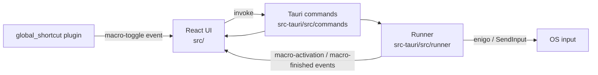
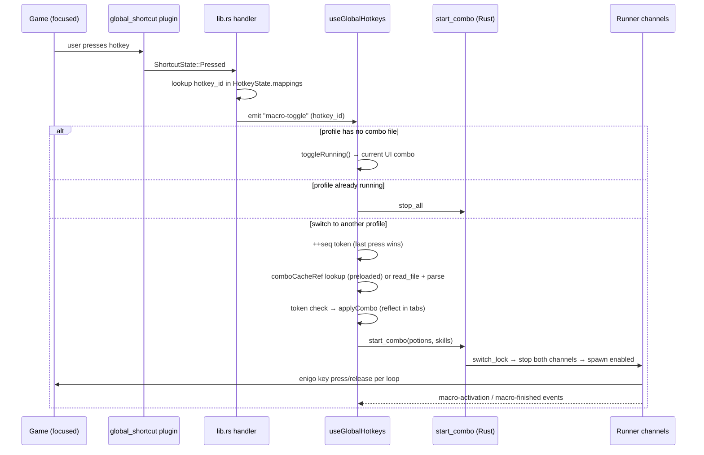
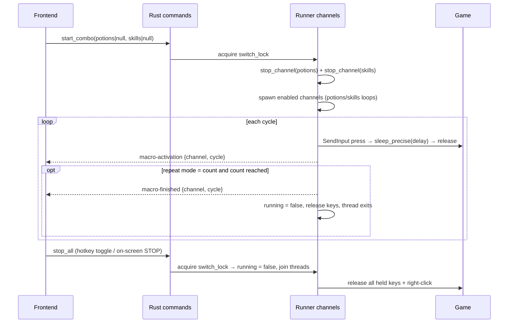

# Architecture — Hamin Macro Recorder

Tauri 2 app: React 19 + TypeScript frontend (`src/`), Rust backend (`src-tauri/`).
The frontend holds all editable state (settings, hotkeys, combo files) and talks to
the backend through Tauri commands; the backend owns the two macro loops and injects
keys with [enigo](https://github.com/enigo-rs/enigo) (Win32 `SendInput` on Windows).



## Component map

| Concern | Frontend | Backend |
|---|---|---|
| App shell, tabs, header | `src/app/` | — |
| Editable settings (potions/skills/hotkeys) | `src/{potions,skills,hotkeys}/use-*-settings.ts` | — |
| Combo files (open/save/new/auto-load) | `src/combo-file/` | `src-tauri/src/commands/files.rs` |
| Global hotkey wiring | `src/hotkeys/use-global-hotkeys.ts` | `src-tauri/src/commands/hotkeys.rs` |
| Start/stop + progress UI | `src/runner/use-macro-runner.ts` | `src-tauri/src/runner/` |
| Recording | `src/recorder/` (`use-recorder.ts` + `events-to-steps.ts`) | `src-tauri/src/commands/recorder.rs` |
| Compact overlay | `src/runner/use-compact-mode.ts` | — (window API) |

All Tauri commands are registered in `src-tauri/src/lib.rs`.

## Flow diagrams

### Hotkey press pipeline



### Start/stop pipeline



Key property: `start_combo`/`stop_all` run under `switch_lock`
(`src-tauri/src/runner/mod.rs`) and **stop both channels before starting**, so a
rapid stop/start can never interleave (e.g. potions of combo A running alongside
skills of combo B).

## Tauri commands

Args/returns are JSON-serialized camelCase (serde `rename_all = "camelCase"`).

| Command | Args | Returns | Purpose |
|---|---|---|---|
| `start_combo` | `potions: PotionConfig \| null`, `skills: SkillConfig \| null` | `()` | Atomically stop both channels, start the provided ones (`null` = leave stopped) |
| `stop_all` | — | `()` | Stop both channels under `switch_lock` |
| `save_file` | `path`, `content` | `()` | Write combo JSON (`fs::write`) |
| `read_file` | `path` | `string` | Read combo JSON (`fs::read_to_string`) |
| `read_jitbit_file` | `path` | `string` | Read `.mcr` text (UTF-8, UTF-16 BOM fallback) |
| `list_combo_files` | `path` (dir) | `{name, path}[]` | List `.json` files in a directory, case-insensitive sorted (used by the Hotkeys tab file picker) |
| `set_hotkeys` | `hotkeys: {shortcut, hotkeyId}[]` | `()` | Diff-register global shortcuts; unregisters removed ones. Transactional: a registration failure re-registers the removed keys (best-effort rollback) and returns Err without mutating state |
| `start_recording` | — | `()` | Start the key-polling thread |
| `stop_recording` | — | `{timestampMs, key, action}[]` | Stop polling, return recorded events |

`PotionConfig`/`SkillConfig` are the backend shapes (`src-tauri/src/runner/potions.rs`,
`skills.rs`); the frontend builds them with `toRunnerInputs` (`src/runner/runner-inputs.ts`).

## Event bus

| Event | Direction | Payload | Frequency |
|---|---|---|---|
| `macro-toggle` | Rust → frontend | hotkey id string | once per hotkey press |
| `macro-activation` | Rust → frontend | `{channel: "potions"\|"skills", cycle, keys?}` | potions: every **10** cycles (throttled); skills: every cycle |
| `macro-finished` | Rust → frontend | `{channel, cycle}` | once, when Repeat-N count is reached |

`macro-finished` does **not** fire for manual stops (only Repeat-N completion); the
frontend resets running state on `stop_all` itself.

## Frontend state & persistence

- `useSettings` (`src/app/use-settings.ts`) composes three sub-hooks: `usePotionSettings`,
  `useSkillSettings`, `useHotkeySettings`. It exposes `applyCombo` (load a combo into
  the tabs), `buildSettings` (current state snapshot), and `reset`.
- **Hotkeys persist to `localStorage`, combos persist to files.** The combo editor's
  dirty state is string-equality against the baseline JSON snapshot taken at open/new/save
  (`src/combo-file/use-combo-file.ts`).
- `useComboFile` also handles the Ctrl+S shortcut, unsaved-changes confirm dialogs, and
  auto-load of the last combo on startup (`combo-macro-auto-load` flag).
- Hotkey registration is debounced 50 ms and persistence 300 ms to avoid jank during edits.

### localStorage keys

| Key | Purpose |
|---|---|
| `combo-macro-settings` | v3 `{version, hotkeys: HotkeyBinding[]}` (debounced save) |
| `combo-macro-last-path` | Last opened/saved combo path (auto-load target) |
| `combo-macro-auto-load` | `"false"` disables auto-loading the last combo on startup |
| `combo-macro-combo-dir` | Combo folder used by the Hotkeys tab file picker |
| `combo-macro-always-on-top` | `"true"` keeps the window always on top |
| `combo-macro-compact-corner` | Compact overlay corner: `auto`/`top-right`/`top-left`/`bottom-right`/`bottom-left` |

## Combo file format

Combos are versioned JSON files (open/save via the file dialogs):

```json
{
  "version": 3,
  "potions": { "enabled": true, "keys": { "q": true, "w": true, "e": false, "r": false },
               "customDelay": true, "delayMs": "150", "repeatMode": "count", "repeatCount": "5" },
  "skills": { "enabled": true, "holdRightClick": false, "labelStyle": "abbreviation",
              "repeatMode": "loop", "repeatCount": "1",
              "steps": [ { "type": "keydown", "key": "1" },
                         { "type": "delay", "ms": "120" },
                         { "type": "keyup", "key": "1" } ] }
}
```

- `version: 2` files are accepted too; import **merges parsed values over defaults**, so
  missing/unknown fields degrade gracefully. Malformed `potions`/`skills` values
  (string, number, `null`) also degrade to defaults via `asRecord` — they can never
  crash or leak spread garbage. Older/unknown versions throw
  (`src/combo-file/combo-io.ts`).
- `delayMs`, `repeatCount`, and step `ms` are strings in the file (input-friendly);
  the backend receives numbers via `toRunnerInputs`.
- `SkillStep.id` is a frontend-only React key (uuid), never serialized to the backend.

### Validation single source (do not duplicate!)

"Can this channel run?" and the delay/repeat clamps are derived in exactly one
place: `derivePotionRun` / `deriveSkillRun` in `src/shared/run-validation.ts`.
Both the live tabs (`usePotionSettings` / `useSkillSettings`) and the
file-loaded path (`toRunnerInputs` in `src/runner/runner-inputs.ts`, a thin
facade over the same functions) call it, so a file-loaded combo behaves
identically to one edited in the tabs.

Rules: potions run if `enabled && any key &&` no delay error (`customDelay && delayMs < MIN_DELAY`
= 2 ms) `&&` no repeat error; skills run if `enabled && ≥1 keydown step &&` no repeat error.
Invalid delays fall back to `MIN_DELAY`; repeat counts clamp to `[1, 999999]`.

**Never re-implement these rules elsewhere — import the derivations.**

## Runner internals (`src-tauri/src/runner/`)

- `AppState` holds two `ChannelState`s (potions, skills): a `running: AtomicBool` + thread
  handle. Stop = flip flag + `join()`; exit always releases held keys.
- Both loops run at `THREAD_PRIORITY_HIGHEST` and use `sleep_precise` (`timing.rs`):
  Windows waitable timer (`CreateWaitableTimerExW`) with a 1 ms cancellation poll,
  falling back to a spin loop if the timer can't be created. `init_timing` calls
  `timeBeginPeriod(1)` once at startup. (See the `sleep_precise` doc comment for the
  history: it replaced a drift-prone `thread::sleep(1)`/spin approach.)
- **Potions loop** (`potions.rs`): per cycle, press each enabled key in `q → w → e → r`
  order, wait `delayMs`, release. Emits `macro-activation` every 10 cycles (throttle).
- **Skills loop** (`skills.rs`): optionally holds right-click for the whole run, then
  executes the step list (`delay`/`keydown`/`keyup`). Emits `macro-activation` every cycle.
- Repeat-N mode emits `macro-finished` and stops the channel when the count is reached.
- Key injection: `parse_key` (`src-tauri/src/runner/injector.rs`) maps each step
  key string to an `enigo::Key`. Single characters inject as `Key::Unicode`
  (SendInput `KEYEVENTF_UNICODE` — the proven path for letters/digits); named
  tokens (`Space`, `Enter`, `F1`–`F24`, `Num0`–`Num9`, `PageUp`, arrows, … —
  the vocabulary emitted by the recorder's `vk_to_readable`) map to real VK
  keys so recorded special keys replay as themselves. Unknown tokens are
  skipped. Jitbit import (`src/skills/parsers.ts`) accepts the same tokens.
- Key release: both loops press/release through a `KeyReleaseGuard`
  (`injector.rs`) whose `Drop` releases the right-click and every step key on
  normal return, Repeat-N completion, cancellation, **or panic** (unwinding
  runs destructors). `lib.rs` also stops both channels on `RunEvent::ExitRequested`,
  since Windows does not auto-release SendInput-injected keys when the
  injecting process dies. Hard-killing the process (task manager) is the one
  path cleanup can't cover.

## Recording (`src-tauri/src/commands/recorder.rs`)

- A high-priority thread polls `GetAsyncKeyState` for all VK codes **every 1 ms**,
  edge-detecting transitions into keydown/keyup events — system-wide, works regardless
  of which window has focus.
- Modifier keys (Shift/Ctrl/Alt) are intentionally skipped (`should_track`).
- Timestamps are milliseconds elapsed since recording start, assigned per poll batch.
- `useRecorder` (`src/recorder/use-recorder.ts`) stops the recording and converts the
  events into the step list; the conversion (`eventsToSteps` + the `RecordedEvent`
  type) lives in `src/recorder/events-to-steps.ts` — a delay step is inserted before
  each event whose timestamp delta is > 0.

## Jitbit import (`src/skills/parsers.ts`)

- The Skills tab's "Import from Jitbit" button opens a native file picker
  (`.mcr` filter); the file is read by the `read_jitbit_file` command
  (UTF-8, with UTF-16 BOM fallback) and parsed by `parseJitbitFile`.
- Line format: `DELAY : N` and `Keyboard : KEY : KeyDown|KeyUp` (case-insensitive).
- Key normalization: `D0–D9` → bare digit (top-row vs numpad); single
  alphanumeric passes through; named tokens (`Space`, `F1`, `Num0`, `PageUp`,
  arrows, … — same vocabulary as the backend `parse_key`) pass through as
  uppercase; anything else is skipped.
- **Strict row validation**: `parseJitbitFile` requires every row to be a
  keyboard row. Mouse rows (movements/clicks with x/y coordinates), text
  typing, or any unknown command reject the **entire file** with the
  offending line number + text — a mixed macro can never be partially
  imported. Unsupported key tokens on `Keyboard` rows (e.g. modifiers) are
  skipped as usual.
- **Tolerated exception**: a single `Mouse : … : RightButtonDown : …` row is
  stripped when it is the very first or very last non-blank row (Jitbit
  records the game-focus click / attack hold there). In the middle, or more
  than once, the file is rejected — real mouse interaction must not be
  silently dropped.
- `parseCombo` (manual entry) converts comma-separated keys + delays into
  keydowns (with inter-key delays), a delay before the keyups, reverse-order keyups,
  and a final rest delay.

## Compact mode (`src/runner/use-compact-mode.ts`)

- While a combo runs, the window resizes to 500×68 logical px (min-size constraints
  cleared) and parks in the chosen screen corner.
- `auto` corner = the corner matching the window center relative to the work-area center.
- On exit the previous size, position, and min-size constraints are restored.

## Testing

Frontend (`npm test`, vitest + jsdom + `@testing-library/react`): pure logic and
hooks are unit-tested; tab components stay manual QA. Infrastructure:

- `vitest.config.ts` — jsdom environment, `@/` alias, `src/test/setup.ts` as the
  global setup file.
- `src/test/setup.ts` — mocks `@tauri-apps/api/*`, `@tauri-apps/plugin-dialog`, and
  `sonner` (the toast mock is callable), rebinds `localStorage` to the jsdom window
  storage (Node ≥ 22's experimental global shadows it), clears storage + mocks + timers
  between tests.
- `src/test/tauri-utils.ts` — `invokeMock`/`listenMock`/`toastMock` accessors and
  `fireTauriEvent(event, payload)`, which dispatches to the handler registered by
  `listen` with the real `Event<T>` shape (`{ payload }`).
- Hook suites must set `invokeMock.mockResolvedValue(undefined)` in `beforeEach`
  (hooks chain `.catch` on `invoke` results) and wrap async flows in
  `await act(async () => { ... })`.

Contracts the suite pins (keep them green when refactoring):

- `src/shared/run-validation.test.ts` — the can-run rules AND the exact
  frontend→Rust wire shapes (`toRunnerInputs` JSON literals; the accept side is
  pinned by Rust's `skill_step_deserializes_from_frontend_json`).
- `src/hotkeys/use-global-hotkeys.test.ts` — the seq/last-press-wins race, the
  combo cache, and the running-profile stop path of `useGlobalHotkeys`.
- `src-tauri/src/commands/hotkeys.rs` — `diff_hotkeys`/`apply_hotkey_diff`
  (rollback on register failure). OS-level `RegisterHotKey` integration is
  deliberately untested (headless CI, hotkey collisions).
- `src-tauri/src/runner/` — channel stop semantics (`stop_all` idempotent, no
  activation events after stop), `KeyReleaseGuard` cleanup incl. panic unwinding,
  `fallback_spin` timing. Recorder `poll_thread` (real `GetAsyncKeyState` input)
  is not unit-testable — its pure helpers are.

## Windows / platform constraints

- Key injection and global hotkeys work **only on Windows** (enigo `SendInput`,
  `RegisterHotKey`); on Wayland/Linux they're OS-blocked (README has details).
- If the target game runs **elevated**, the app must run as administrator too — UIPI
  silently blocks input injection otherwise. Global hotkeys not reaching a game are
  almost always this.
- The Rust lib crate is named `combo_macro_recorder_lib` — the `_lib` suffix is a
  required Windows cargo workaround, don't rename it.
- Rust test binaries crash at load with `0xc0000139` unless they get the
  Common-Controls v6 manifest (`comctl32!TaskDialogIndirect` only exists in the
  WinSxS v6 copy). `src-tauri/build.rs` embeds it into every artifact; the app
  binary gets the same manifest from tauri-build. See tauri-apps/tauri#13419.
